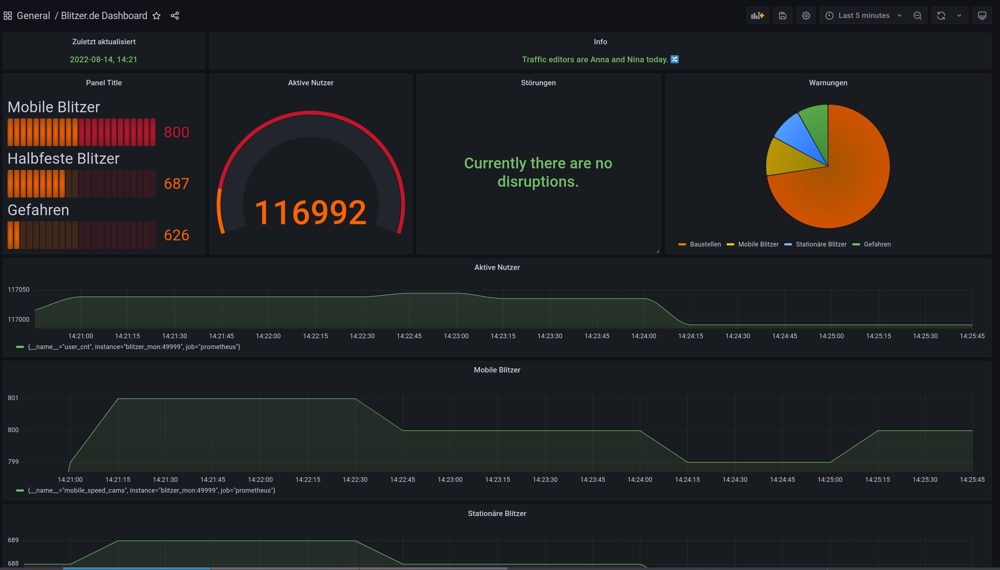

# Blitzermon

Grafana dashboard + Prometheus exporter for visualizing (mobile) speed cams in Germany.

## Setup

- Raspberry Pi 4 with 2 gb RAM (other PIs may also work, but I wanted ARM 64 bit)

## Demo pictures



## Installation

## Prepare Raspi

Install Python and pip:

`sudo apt install python3-dev python3 python3-pip -y`

Install Docker + Docker-compose (reboot required)

```bash
curl -sSL https://get.docker.com | sh
sudo usermod -aG docker ubuntu
sudo pip3 install docker-compose
sudo systemctl enable docker
sudo reboot
```

Now get this repo and then run `docker-compose up -d`

## HTTPS

It is also possible to access the Grafana Dashboard over HTTPS.
Depending on your security requirements and/or threat model it might be a good idea to enable HTTPS.

Generate a self signed certificate for your domain:

`sudo openssl req -x509 -nodes -days 365 -newkey rsa:2048 -keyout ./nginx/nginx-selfsigned.key -out ./nginx/nginx-selfsigned.crt`

Replace the content of `./nginx/nginx.conf` with:

```txt
server {
  listen 80;
	listen [::]:80;
	server_name _;
	return 301 https://$host$request_uri;
}

server {
  listen 443 ssl;
  listen [::]:443 ssl;
  include ssl/self-signed.conf;

  location / {
   proxy_set_header Host $http_host; 
   proxy_pass http://grafana:3000/;
  }
}

```
